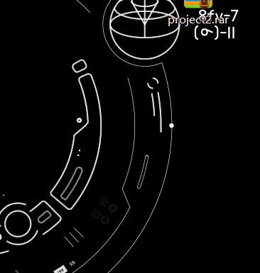

## 


* C++有bool变量 非零数为true 0为false

  #### 字符串类

  * cin cout不能scanf printf 以空格为分隔符
  * 字符串拼接用+

* getline可以输入包含空格的字符串，需引入`#include<string>`

* length()  substr() 字符串下标从0开始

* 结构体 不能用string 用char[]代替

* 函数的引用和传值 传参前加&表示传的是参数的引用，加&才能改变传递的参数

  

  #### 类的构造函数
  
  ```c++
  student(int a = 0,int b = 0)
      : a0(a), b0(b)
      {}
  ```

  等同于 `a0 = a,b0 = 0;`

  #### 模板

  ##### 1. 函数模板

  T即为形参，几个形参几个T
  
  ```c++
  template<class T>
      T max(T a,T b)
  {
  	return a>b?a,b;
  }
  ```

  ##### 2.类模板
  
  ```C++
  template<class T>
  class A
  {
      public:
      A(T a,T b)
          :a0(a),b0(b){}
      T geta(){return a0}
      T getb(){return b0}
      private:
      T a0;
      T b0;
  }
  int main()
  {
      A<int>a(1,2); //类模板的实例化
      A<double>b(1.2,2,3);
  }
  ```

  ### 列表

  

  #### 无序列表 

  

  ##### 接口
  
  * 静态操作：get  search
  * 动态操作：insert  remove
  * 存储方式：动态、静态

  ##### 定义
  
  * 列表运用动态存储
  * 其中的元素为节点
  * 节点由指针联结
  * 相邻节点：前驱 后继

  ##### 循秩访问

  从头出发，沿着指针引用访问——成本高

  ##### 循位置访问

  利用节点间的相互引用

  ##### List模板类

  

  头尾节点不可见，首末节点可见

  ##### 初始化  O(1)

  

  初始化list时，创建头尾节点，且二者互为前驱和后继

  ##### 插入实现  O(1)

  
  
  1. 以p为节点，在p的前驱插入数值为e的节点
  2. ->即为调用的意思，相当于p.insertAsPred(e)，即此函数的实现是由insertAsPred接口实现
  3. 先创建一个新的节点，以this的pred为前驱，以this为后继
  4. 将pred的后继改为x，将this的前驱改为x
  
  * 若在插入时this为首节点，存在header头节点
  * <u>前驱后继的改变顺序不能变否则x的succ为自己</u>4.

  ##### 复制法构造list O(n)

  
  
  1. 初始化头尾节点
  2. 将p节点的数据插入新建list的末尾，即trailer之前
  3. p节点指向它的后继，继续插入至末尾

  * insertAsLast即为insertBefore(trailer)

  ##### 删除  O(1)

  

  1. 备份待删除的节点

  2. p的后继的前驱指向p的前驱，p的后继的前驱指向p的前驱

     <u>此时p与列表关联性很弱</u>

  3. 释放p节点（删除p的前驱与后继）

  4. list长度减一

  ##### 析构（销毁list）O(n)

  ##### 

  clear实现：<u>反复删除首元素</u>，即头节点的后继直到size为0，返回删除list的规模
  
  ##### 查找  O(n)
  
  ##### 
  
  * 以p为节点，在p的n个前驱中进行查找，与数值e进行比对
  * 若命中，则返回节点p，若失败，返回null
  
  
  
  * 第二个为在以p为节点，n个后继中进行查找


  * 若p的前驱中有多个相同的e，则需遍历p的n个前驱，故O(n)

  ##### 去重  O(n)

  

  1. 判断是否为平凡列表
  2. 记录原规模
  3. 记首节点为p，初始查找p的前驱的个数为r   find(e,r,p)
  4. p不断前进直到末节点
  5. r递增，<u>r即为p节点前驱的所有节点个数</u>
  6. 标记find到与p相同的节点，remove it
  7. 返回去重后的规模

  

  #### 有序列表

  ##### 唯一化（去重） O(n)

  

  1. 指定首节点为p，q为p的后继
  2. 判断p和q的值是否相等，若是，则remove q，若不是，则将q节点变为p节点
  3. 返回去重之后的size

  * 节点可以直接赋值 p=q

  ##### 查找

  

  1. 查找节点p的n个前驱，值为e
  2. 将p不断迭代为p的前驱，找到小于等于e的节点p
  3. 返回节点p


  ### 向量Vector

  #### 有序向量

  ##### 抽象数据类型ADT

  

  * 数据类型：int/float/char
  * <u>ADT：Vector/List 只需要知道能完成什么功能，不需要知道如何实现细节</u>
  * ADT接口：size() , get() ,sort()等具有特定功能的操作来对抽象数据类型进行操作

  ##### 封装 模板类

  

  * **elem为定义的连续的存放数据的空间，空间大小与capacity相同**

  ##### 构造

  

  1. 创建一个容量为c，数据类型为T的**连续的**数据空间
  2. 将数据空间的首地址赋值给elem
  3. 定义向量的大小为0

  

  * 从已经存在的数组复制，<u>调用内部函数copyFrom</u>

  

  ##### 析构

  

  ##### 复制copyFrom

  

  * A为copyFrom的数组，lo为数组起始位置，**hi为不属于这个数组的第一个元素**
  * 

  

  1. elem是定义在vector模板类里的数据空间，不需要定义
  2. *A从lo开始赋值，elem从0开始被赋值

  ##### 静态空间管理

  * 开辟一段连续的数据空间，大小为capacity

  * 上溢：elem存不下

  * 下溢：容量开辟很大，实际大小size很小，则装填因子（空间利用率）很小

    

  ##### 动态空间管理，扩容算法

  

  * 若A[ ]当前capacity已满，则将A copy至 B[ ] 中，B的容量更大，同时释放A的空间。
    1. 若size==capacity，先将容量空间* oldElem 备份
    2. 将elem的数据空间加倍
    3. 将oldElem中的元素赋值给新的elem
    4. 释放oldElem

  ##### 递增扩容策略  O(n<sup>2</sup>)   分摊到n个为O(n)

  

  * 每次扩容i个固定长度
  * 算法即为将上一个扩容算法的空间分配算法的一行代码改变
  * 连续插入m个i组元素
  * 一共需要做m次扩容

  ##### 递增扩容策略  O(n)  分摊到n个为O(1)

  

  * 每次插入一个元素

  ##### 平均时间复杂度与均摊时间复杂度

  * **平均时间复杂度**即为有n种可能，对应的复杂度有n个，每种可能发生的概率即为每种可能的**权重**，最终计算复杂度需要考虑各个可能的权重
  * **均摊时间复杂度**即为总的复杂度/出现的可能数n
  * 一般均摊时间复杂度为最好的时间复杂度

  

  #### 无序向量

  ##### 循秩访问

  向量vector可以像数组一样通过v[ ]来访问元素

  ##### 插入

  

  * 在插入点之后的所有元素后移一位

  * expand中有判断size是否等于capacity

  * **插入点之后元素的移动顺序是从后往前，从末尾开始后移**（若下标处理不当，有重叠覆盖的风险）

    

  ##### 区间删除  O(n)

  

  * **删除的区间为左闭右开**，hi并未删除

  * ++是先使用再递增，故是将hi赋值给lo
  * 将hi到n的元素移位的顺序是**从前向后**（若从后向前，下标处理不当，有重叠覆盖的风险）
  * shrink缩容非必须

  ##### 单元素删除   O(n)

  

  * 考虑到remove函数删除的是秩为lo到hi-1的元素，则删除单元素只需调用r到r+1-1

  ##### 查找

  

  * **逆序查找**，**当有多个元素相同时返回秩最大的**

  ##### 唯一化

  

  1. 从秩为1的元素开始查找，若查找函数的返回值合法即找到，则删除，若不合法，则向后移动
  2. 不需要考虑find函数仅能找到秩最大的，去想是否存在比秩最大的还小的秩存在相同元素的问题，**因为是逐个向后find，故相同的元素全部被remove**

  * **复杂度**：
  * 

  1. 复杂度是由while和内部的find remove产生的
  2. while复杂度为O(n
  3. find遍历的元素是当前元素之前的元素，即[0,i），remove遍历的元素是当前元素之后的元素，即U，**二者加起来恰好为O(n)**
  4. **故总体的复杂度为O(n<sup>2</sup>>)**


#### 栈

* 能够访问的元素称为：**顶端 top** 
* 最底部的元素称为： **底端 bottom**
* LIFO last in first out


* 操作：
  * push( a )
  * pop( ) ：返回弹出的顶部元素的值并将其删除
  * empty( ) ：返回T/F
  * top( ) ：返回顶部元素的值
  * size( ) ：返回栈中元素个数

##### 由向量派生的栈


1. 插入、删除都是在**向量末端**进行，故上述所有操作复杂度均为O(1)
2. 在向量末端而不是前端：若插入与删除发生在向量的前端，则涉及到向量整体的移动，复杂度为O(n)

#### 栈的应用

1. ##### 进制转换


* 计算顺序是自上而下，而输出顺序为自下而上

  

  ##### 2.括号匹配

  * 概述：判断一个含有多个括号的表达式是否每个左括号都有唯一的右括号与之对应
  * 思路：

  

  1. 消去表达式中一对**紧邻**的左右括号对表达式无影响

  2. 使用栈的结构，扫描所有括号，**先将所有左括号入栈，之后每遇到一个右括号，弹出一个左括号**。

     若左括号与右括号全部匹配，则最终栈会空，说明括号匹配。

     若栈中还有剩余的左括号，则括号不匹配。

  * 实现

    

  * 推广：

    若推广至小、中、大括号并存的情况下，同样可以用栈实现

    但在左括号全部入栈遇到右括号判定时，**需添加栈顶的左括号与第一个右括号是否匹配的判断条件**    即若  ( [ ) ] 是不行的，因为首个左右括号不匹配


### 链表

* 一个元素包含data和pointer，指向next
* 链表的curr当前指针是当前元素的前一个元素的指针，即此指针指向当前的元素

### 双链表

* 即有data pre next双指针


### 栈

* 先进后出
* 插入和删除只能发生在前端
* 接口
  * push( )
  * pop( ) ：return elem + remove( )
  * topvalue( )：return elem
  *  length( )
* **顺序表实现的栈**
  
  * 一个数组存储，一个整型变量top为栈顶<u>索引值</u>，一个整型变量maxsize为栈最大容量
  * 栈空时 top=0
  * **top实际为栈顶元素的上一个位置**，topvalue的return值为arrayList[top-1]
  * push() 即为在top位置用顺序表的插入功能插入一个值，且top++
  * pop() 即为remove() 并top--
  * 顺序表实现有栈满的风险 top == maxsize
  
* **链表实现的栈**

  * 一个指针top指向栈顶元素，一个整型变量size

  * 无栈满风险

  * 插入a操作实现

    ```C++
    p=new link(a);
    p->next=top;
    top=p;
    size++;
    ```

  * 删除a实现

  ```C++
  link *temp=top;//先对要删除的栈顶元素进行备份
  top=top->next;
  element it=temp->element;
  delete temp;
  size--;
  return it;
  ```


### 队列

* 先进先出

* **从尾部rear插入 enQueue入队，从头部front删除 deQueue出队**

  **尾部为链表的最前节点，头部为链表的首个节点**

  rear节点的next为NULL

* 链式队列

  * 两个指针，front在链头，指向第一个有元素的节点，故**front是一个空节点**

    ​					rear在链尾，指向最后一个节点

    ​					一个整数size

    

  * 入队实现

  ```C++
  p=new link(a);
  rear->next=p;
  rear=p;
  size++;
  ```

  * 出队

  ```C++
  temp=new link();
  temp=front->next;
  front->next=temp->next;
  it=temp->element;
  delete(temp);
  return it;
  ```

* 顺序表队列

  * 一个数组存储，一个整型front为队头索引，一个整型rear为队尾索引（**rear始终为最后一个元素的下一个元素**），一个maxsize

    **（length=rear-front）**

  * 入队：**在rear处插入**，再rear=rear+1
  * 出队：front=front+1   （易形成伪队满）
  * rear==maxsize队满，rear=front队空 环队列：解决伪队满

  * 队头与队尾相连

  * 若front+1或rear+1与maxsize相等，则从maxsize-1直接跳转至0----------环形队列

    将入队出队的代码改写为

  ```C++
  if(rear<maxsize)
  listArray[rear]=it;
  rear=(rear+1)%maxsize;   //只需在末尾加上这句
  ```

  * 长度计算：**length=(rear-front+maxsize)%maxsize**

    但这样的话队空与队满length都为0

    且队空队满的条件都会出现rear=front

    * **解决方案1**：设置计数器count

      队空 count==0；

      在入队和出队时count++/--

      队满 count==maxsize

    * **解决方案2**：rear处空出不用
    
      队满条件：**（rear+1）%maxsize==front**
    
      队空：rear==front

  

  

  ### 树

  * 动机

    * 向量的优势为查找，列表的优势为插入删除，**树可以将二者优点融合**，兼顾**静态和动态**操作
    *  树可以认为是列表的列表 List<List>,**半线性结构**

  * 应用

    * 文件系统：一个文件夹下多个子目录，子目录的子目录

  * 有根数

    * 对于一个一般的树，指定唯一的顶点为根，则它为有根树

    * 若引入一个新的根，将它与多个树的树根连接，则构成一个更大的有根树

      

      * 组成的各树为**子树**，r为其**父亲**，ri之间互为**兄弟**
      * 任何一个节点**所拥有的孩子数目**称为度数d，顶点的数目n，边的数目e

      

      即：一个树结构的**所有**边数=所有节点的度数之和=顶点数目-1

      * 即顶点数目n与所有边数e是**同阶的**
      * 在衡量树的复杂度时，通常以n为参考，则可以以e顶点数目作为参考

  * 路径，通路

    * 通路：k+1个节点依次连接成k个边，构成的路径
    * 路径长度：定义为边数k

  * 树的连通性与无环性  判断兄弟之间的关系

    * 在图论中可定义为**无环连通图**
    * 树的任一节点v与根之间均存在**唯一路径**  path(v)  判断指标即为路径长度

    

  * 深度、层次

    * **深度**：depth(v) = | path(v) |，根到节点的路径长度

    * path(v)上的所有除v节点均为v的**祖先**,v为**后代**

      * 一个深度固定，后代的祖先唯一（唯一路径），而祖先的后代未必唯一
      * 半线性结构：类比链表的前驱和后继均唯一

    * 没有后代的节点称为**叶子**（degree==0），叶子深度最大者称作树的**高度**（子树高度：以子节点作为根向下的高度）

      * 一个节点都没有的**空树** 高度为-1,只有一个节点的树高度为0（根节点从0

        

      
      
      则对任一节点v：depth(v)+height(v)<=height(T) (全树高度)
    
  * 度：与节点向下相连的边数

  

  

  #### 二叉树

  * 一个节点最多有两个子节点
    * 满二叉树：所有的节点的度都是2，除了叶子节点的度为0
    * 完全满二叉树：所有节点
    * 满二叉树：除了叶节点，所有节点都
    * 完全二叉树：除了最后一层，其余曾均满（度为2），且最后一层不满，缺右边
    
  * 分类
    * 左右指针+data三个空间
    * 可变结构节点：判断是否为叶子，是叶子没有左右节点
    * 左右指针+data+parent四个节点
    
  * 二叉树的遍历

    * 深度优先遍历

      * 前序 中序 后序

      递归实现

    * 广度优先遍历

      * 从上至下，从左到右

  

  #### 二叉搜索树

  * 左子节点比根节点小，右子节点大于等于根节点
    * 同一组数据组成的二叉搜索树中序遍历结果相同，从小到大排列
  * 实现BST需要一个指针，一个int 节点数
  * 查找：与根比较，小于向左，大于向右，递归
  * 插入：插入后仍为BST，先比较找到合适节点（叶子节点/度为1），小于插入左树，大于插入右树（一层一层比）
  * **删除**：删除后仍为BST
    * 叶节点：parent设置为null
    * 只有左/右子树：将parent的指针指向此节点的子树
    * 既有左又有右：找到其右子树的最小值，代替此节点，删除最小值节点（叶/度为1即只有一个右子节点）

  

  #### 堆（优先队列）

  * 1.完全二叉树 

    2.父节点大于等于子节点：大堆，小于等于：小堆

  * 基于数组方式实现

    * 一个数组存储，一个maxsize，一个当前size
    *   floor为向下取整，即小于等于
    * siftdown，根节点的左右子树为堆，但整个不为堆

    从倒数第二行开始，从右向左，从下往上，

    **将CBT变为一个大堆**

    * 插入一个元素：在数组末尾插入该元素，该节点作为当前节点，与其父节点比较，大于则交换，将父节点作为当前节点
    * 移除根节点：将最末元素与根节点的值交换，size--，对堆做siftdown
    * 移除指定节点：
      * 将指定节点作为当前节点
      * 将末节点的值与当前节点的值交换
      * 当前节点与父节点比较，大于交换，且更新当前节点
      * 最终对当前节点做siftdown、

  

  #### 哈夫曼树

  * 满二叉树FBT，即度不是2就是0
  * 意义：哈夫曼树的加权路径长度WPL为最小
  * 权值越小的树路径越长，权值越大路径越短
  * 哈夫曼树的构造：最小的先排，放在底部
  * 哈夫曼编码：左路记为0，右路记为1

  

  ### 通用树

  * 两个数组：一个按层存元素值，一个存对应下标元素的双亲的下标
  * 一个int：数组的大小
  * find()：返回查找到的节点的父节点下标
  * union(a,b)：将b的父节点改为a的父节点，若a无父节点即a为根节点，则b的父节点改为a

  * 通用树改为二叉树：两个指针：左孩子和右兄弟，一个数据域。
    * 从根开始，从上到下，从左到右，对通用树的每一个节点均判断一次。
  * 先根遍历：先遍历根，孩子从左到右
  * 后根遍历：先孩子从左到右，再根
    * 通用树的先根遍历->二叉树先序
    * ​                后根遍历->二叉树中序
  * 森林：多个互不相关的通用树
  * 将森林转换为二叉树：
    * 将每棵树改为二叉树
    * 将k+1棵树的根节点作为k棵树的右孩子
  * 

  

  

  

  

  

  

  

  

  

  

  

  

  

  

  

  

  ### C++语法

  * typedef关键字：若有 `typedef int a1;`，则可 `a1 m;`如此定义，即定义一个int类型，其标识符名称为a1。

    同样可以用typedef定义一个结构体，结构体名称就成了一个类型名称

    

```C++
typedef struct Books
{
   char  title[50];
   char  author[50];
   char  subject[100];
   int   book_id;
} Book;
 
int main( )
{
   Book book;//可直接定义Book类型变量
}
```

##### 三元运算符

expression ? a : b      若expression为真，则执行a，否则为b 


##### 访问控制


##### 继承、派生


派生类可以使用父类的所有public与protected方法


### 数组引用传值（数组作为传参并改变数组的值）

```C++
int main(){
int a[100];
function1(a);  //数组引用传值
function2(a);  //数组普通传值
}
function1(int (&a)[100]){..}   //可以看作是数组a的**别名**，且必须要指定数组的大小
function2(int a){..}  //不会改变数组a的值
```

